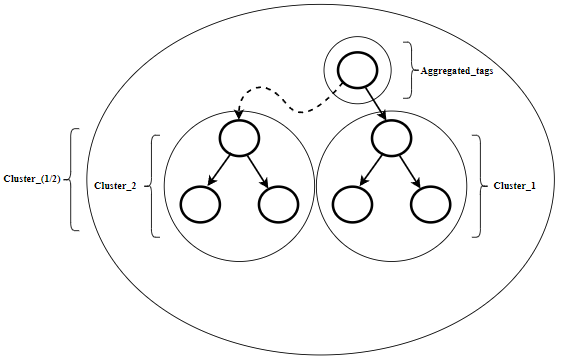

___
# Data Aggregation Algorithm
This is a Thesis project in which, we developed a data aggregation algorithm and tested it in a IoT like environment using the contiki/cooja os.
___
## Motes
The motes we used are similar with that in the [Data-Collector Project](https://github.com/taratandel/Data-Collector) with a major difference in the sink/panc mote.

___
## Algorithms function
The algorithm is using a JSON like input (sensor message) to seperate the sensor tags from their input. After that it creates a phylogenetic tree based on the closest pairs of the tags, using a distance  calculation metric such as the Hamming distance.
___
